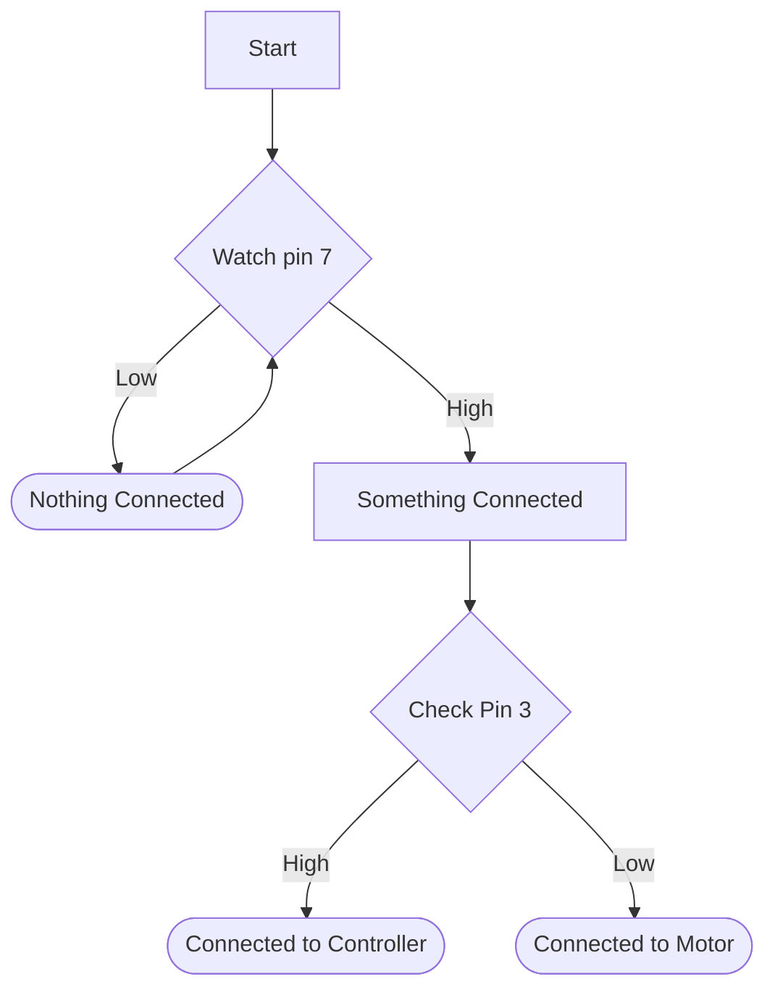

# drag-racer-track-v2
A new and improved version of [mini-drag-racetrack](https://github.com/rivques/mini-drag-racetrack).

## How To Use
To be written.

## Bill Of Materials
* 2x [Adafruit beam-break 3mm sensors](https://www.adafruit.com/product/2167)
* 4x [SparkFun RJ45 breakouts](https://www.sparkfun.com/sparkfun-rj45-breakout.html) with [SparkFun RJ45 conectors](https://www.sparkfun.com/rj45-8-pin-connector.html)
## Project Proposal
Available at [this Google doc](https://docs.google.com/document/d/1fPM3jAb2btpLcQTNEUYPZXAGJ7guPSih1aArkj4l1_s/edit?usp=sharing).

## Circuit Diagram
### Commmunication
The three modules communicate over straight-through CAT-5 (aka Ethernet) cable. This is a convenient, flexible multi-conductor cable. 

This pinout is constructed to allow near-unambiguous determination by the main processor of 1. if a cable is connected and 2. if the cable is connected to the motors or the screen.
To do this it can do the following:

This approach does fail if the smart controller is plugged in while the reset button is pressed. However, it should catch most crossed wires.

The pinout is as follows (assuming T568A terminations):
#### Main-Motor (purpose and direction from Main's perspective):
RJ-45 Pin # | T568A color | Purpose | Direction | Notes
---|---|---|---|---
1|Wh/Gr|GND|Bidirectional|Shared ground reference
2|Gr|TX|OUTPUT|UART 8N1@9600 baud
3|Wh/Or|Discrim|INPUT|Tied to GND at Motor
4|Bl|NC||
5|Wh/Bl|3V3|OUTPUT|
6|Or|RX|INPUT|UART 8N1@9600 baud
7|Wh/Br|Presence|INPUT|Tied to 3V3 at Motor
8|Br|NC||

#### Main-Button Controller (purpose and direction from Main's perspective):
RJ-45 Pin # | T568A color | Purpose | Direction | Notes
---|---|---|---|---
1|Wh/Gr|GND|OUTPUT|
2|Gr|NC||
3|Wh/Or|Discrim|INPUT|Tied to 3V3 at Controller
4|Bl|RESET|INPUT|
5|Wh/Bl|3V3|OUTPUT|
6|Or|ARM|INPUT|
7|Wh/Br|Presence|INPUT|Tied to 3V3 at Controller
8|Br|RACE|INPUT|

To be created.

## 